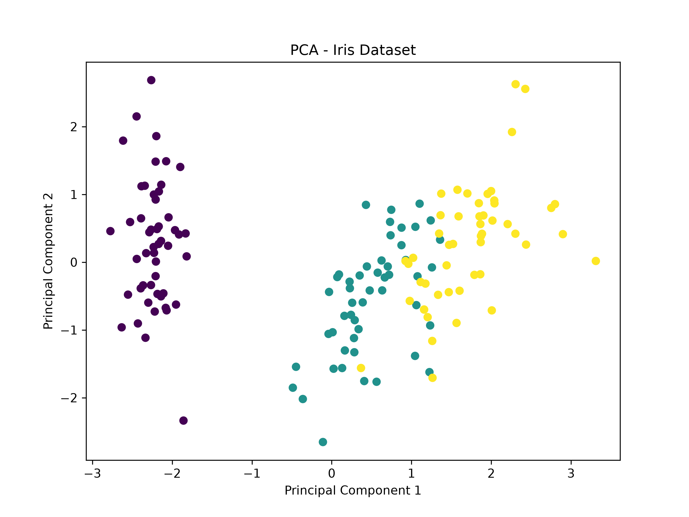

# 📉 PCA - Iris Dataset

A Machine Learning project demonstrating **Principal Component Analysis (PCA)** for dimensionality reduction using the Iris dataset.

## 📌 Project Overview

Principal Component Analysis (PCA) is a dimensionality reduction technique that transforms the original features into a smaller set of new features called **Principal Components** while preserving as much variance as possible.

In this project, the Iris dataset is reduced from **4 original features to 2 Principal Components** and visualized using a scatter plot.

## 🧠 How PCA Works

The project follows these main steps:

1. Load the Iris dataset.
2. Separate the input features and target labels.
3. Standardize the input features.
4. Apply PCA with 2 components.
5. Transform the original 4-dimensional data into 2 dimensions.
6. Calculate the explained variance.
7. Visualize the transformed data.

## 📊 Dataset

The project uses the built-in **Iris dataset** from Scikit-learn.

### Original Features

* Sepal Length
* Sepal Width
* Petal Length
* Petal Width

The original dataset contains:

* **150 samples**
* **4 features**
* **3 Iris species**

The target labels are used only for visualization and are **not used by PCA during the transformation**.

## ⚙️ PCA Configuration

```python
pca = PCA(n_components=2)
```

This reduces:

```text
4 Original Features
        ↓
       PCA
        ↓
2 Principal Components
```

### Principal Components

* **PC1** captures the maximum possible variance.
* **PC2** captures the next highest variance while remaining independent of PC1.

## 📏 Feature Standardization

Before applying PCA, the features are standardized using `StandardScaler`.

```python
scaler = StandardScaler()
X_scaled = scaler.fit_transform(X)
```

Standardization is important because features with larger numerical scales could otherwise have a greater influence on the PCA transformation.

## 📈 Explained Variance

The project calculates the variance captured by each principal component using:

```python
pca.explained_variance_ratio_
```

The total variance preserved by the selected components is calculated using:

```python
pca.explained_variance_ratio_.sum()
```

For the Iris dataset, the first two components preserve approximately **96% of the total variance**.

## 📊 Visualization

The transformed data is visualized using the first two Principal Components:

* X-axis → Principal Component 1
* Y-axis → Principal Component 2

The generated visualization is saved as:

```text
images/pca_iris.png
```



## 🛠 Technologies Used

* Python 3
* Scikit-learn
* NumPy
* Matplotlib

## 📂 Project Structure

```text
PCA_iris/
│
├── PCA_iris.py
├── README.md
├── requirements.txt
├── .gitignore
└── images/
    └── pca_iris.png
```

## 🚀 How to Run

### 1. Clone the repository

```bash
git clone https://github.com/Jasim-AG/ai-engineer-journey.git
```

### 2. Navigate to the project

```bash
cd projects/PCA_iris
```

### 3. Install dependencies

```bash
pip install -r requirements.txt
```

### 4. Run the program

```bash
python3 PCA_iris.py
```

## 📖 Learning Outcomes

Through this project, I learned:

* Principal Component Analysis (PCA)
* Dimensionality Reduction
* Principal Components
* Explained Variance
* Feature Standardization
* `StandardScaler`
* `PCA(n_components=2)`
* `fit_transform()`
* `explained_variance_ratio_`
* PCA visualization

## 🔮 Future Improvements

* Compare different numbers of Principal Components.
* Plot cumulative explained variance.
* Apply PCA to a higher-dimensional dataset.
* Compare model performance before and after dimensionality reduction.
* Use PCA as a preprocessing step for Machine Learning models.

## 👨‍💻 Author

**Jasim AG**

GitHub:
https://github.com/Jasim-AG/ai-engineer-journey
