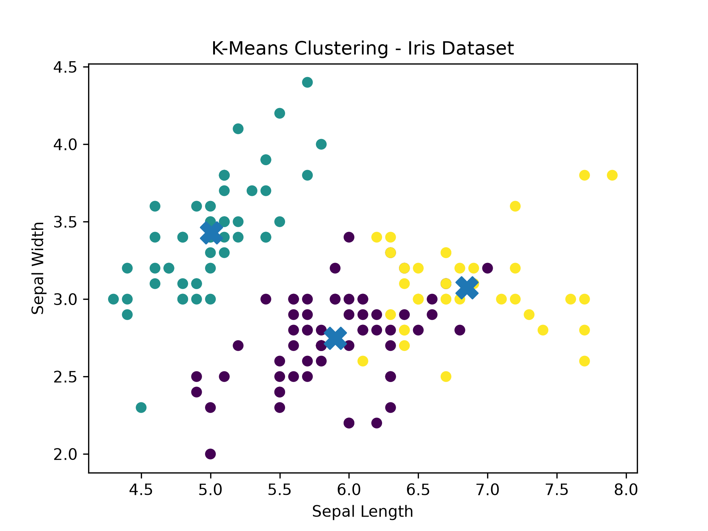

# 🔵 K-Means Clustering - Iris Dataset

An Unsupervised Machine Learning project that uses the **K-Means Clustering** algorithm to group Iris flowers based on their features.

## 📌 Project Overview

Unlike supervised learning algorithms, K-Means does not use target labels during training.

The algorithm identifies groups of similar data points by assigning them to clusters based on their distance from cluster centroids.

This project uses the Iris dataset and creates **3 clusters**.

## 🧠 Algorithm

**K-Means Clustering**

```python
model = KMeans(
    n_clusters=3,
    random_state=42,
    n_init=10
)
```

### How K-Means works

1. Choose the number of clusters (`K`).
2. Initialize centroids.
3. Assign each data point to its nearest centroid.
4. Recalculate the centroid of each cluster.
5. Repeat until the clusters stabilize.

## 📊 Dataset

**Dataset:** Iris Dataset

Features used:

- Sepal Length
- Sepal Width
- Petal Length
- Petal Width

Unlike the supervised Iris projects, the target labels are **not used** for clustering.

## 🛠 Technologies Used

- Python 3
- NumPy
- Matplotlib
- Scikit-learn

## 📂 Project Structure

```text
kmeans_clustering/
│
├── kmeans_clustering.py
├── README.md
├── requirements.txt
├── .gitignore
└── images/
    └── kmeans_clusters.png
```

## 📈 Output

The project visualizes the clusters using Sepal Length and Sepal Width.

The `X` markers represent the cluster centroids.



## 📖 Learning Outcomes

Through this project, I learned:

- Unsupervised Learning
- Clustering
- K-Means Algorithm
- Centroids
- Cluster Assignment
- `n_clusters`
- `cluster_labels`
- `cluster_centers_`
- Data Visualization

## 🚀 How to Run

Clone the repository:

```bash
git clone https://github.com/Jasim-AG/ai-engineer-journey.git
```

Navigate to the project:

```bash
cd projects/kmeans_clustering
```

Install dependencies:

```bash
pip install -r requirements.txt
```

Run the program:

```bash
python3 kmeans_clustering.py
```

## 🔮 Future Improvements

- Use the Elbow Method to select K automatically.
- Compare different values of K.
- Visualize clusters using other feature combinations.
- Apply K-Means to a real-world customer segmentation dataset.

## 👨‍💻 Author

**Jasim AG**

GitHub:  
https://github.com/Jasim-AG/ai-engineer-journey